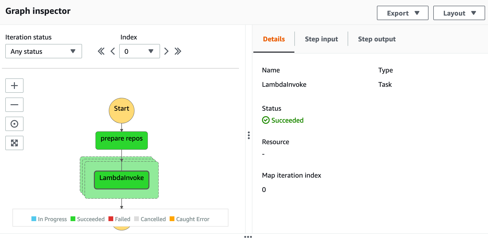
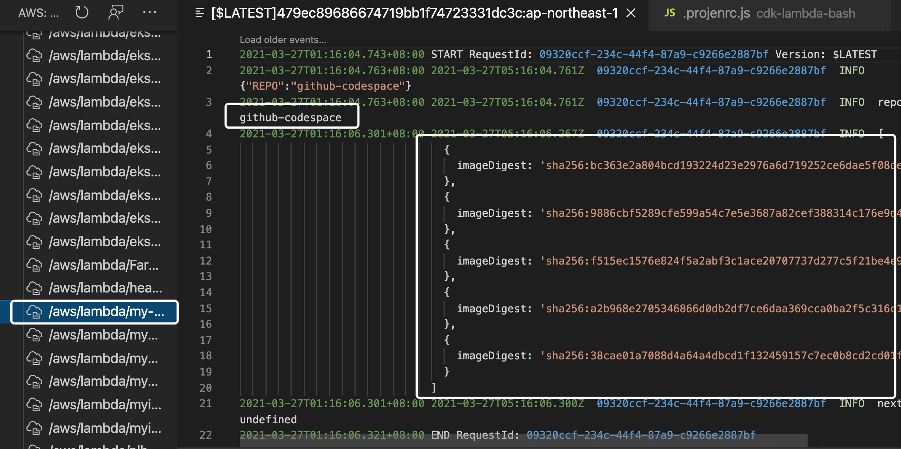

[](https://badge.fury.io/js/cdk-ecrpublic-gc)
[](https://badge.fury.io/py/cdk-ecrpublic-gc)


# cdk-ecrpublic-gc

CDK construct library that helps you build a garbage collector to delete all untagged images in Amazon ECR public with AWS CDK.

# Why

Amazon ECR public does not have lifecycle policy to clean up all untagged images at this moment(see [this issue](https://github.com/aws/containers-roadmap/issues/1268)). `cdk-ecrpublic-gc` allows you to deploy a **AWS Step Functions** state machine with [dynamic parallelism](https://aws.amazon.com/tw/blogs/aws/new-step-functions-support-for-dynamic-parallelism/) to invoke an arbitrary of Lambda functions to remove untagged images to release the storage. 

# Schedule


By default, the state machine will be triggered **every 4 hours** and can be configured in the `schedule` property in the `TidyUp` construct.


# Sample

```ts
const app = new cdk.App();

const stack = new cdk.Stack(app, 'ecr-public-gc');

new TidyUp(stack, 'TidyUp', {
  repository: [
    'vscode',
    'gitpod-workspace',
    'github-codespace',
  ],
  schedule: events.Schedule.cron({ hour: '*/4', minute: '0' }),
});

```

# In Action

Step Function state machine with dynamic tasks in parallel




